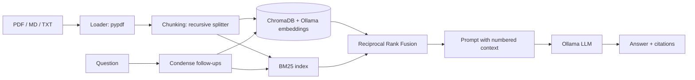

# 📄 DocMind: chat with your documents (local hybrid RAG)

Ask questions about your own **PDF, Markdown and text files** and get answers with **numbered citations**
that point to the exact file and page. It runs fully on your machine with [Ollama](https://ollama.com), so
there are no API keys, no cloud and no data leaving your laptop.

> Built to demonstrate a production-style RAG pipeline: hybrid retrieval, grounded answers, an evaluation
> harness and tests, not just a "PDF chatbot" demo.

## Features

- **Hybrid retrieval**: dense vector search (ChromaDB + `nomic-embed-text`) and BM25 keyword search, merged with
  **Reciprocal Rank Fusion**. BM25 is implemented from scratch in about 50 lines.
- **Cited answers**: every answer carries `[1]`, `[2]` markers linked to the source passage, file and page.
- **Follow-up questions**: a follow-up such as "and what are its limits?" is rewritten into a standalone query
  before retrieval.
- **Hallucination guardrails**: a strict prompt, a refusal when nothing relevant is retrieved, and retrieved text
  treated as untrusted data (a basic prompt-injection defence).
- **Idempotent ingestion**: deterministic chunk IDs, so re-uploading a file never creates duplicates.
- **Evaluation harness**: Hit@k, MRR and latency for vector vs BM25 vs hybrid, plus optional answer grading.
- **Three interfaces**: a Streamlit chat UI, a CLI and a small Python API.
- **Tests and CI**: unit tests for the core logic and a GitHub Actions workflow.

## Architecture



## Quick start

```bash
# 1. Install Ollama (https://ollama.com), then pull a chat model and an embedding model
ollama pull llama3.2
ollama pull nomic-embed-text

# 2. Install the app
git clone https://github.com/<your-username>/docmind-rag.git
cd docmind-rag
python -m venv .venv && source .venv/bin/activate      # Windows: .venv\Scripts\activate
pip install -r requirements.txt

# 3. Run the UI
streamlit run app.py
```

In the sidebar, click **Load sample documents** (or upload your own files), then start asking questions.

### Command line

```bash
python -m docmind.cli ingest data/sample_docs
python -m docmind.cli ask "How do I keep data after a container is removed?"
python -m docmind.cli ask "What is Reciprocal Rank Fusion?" --mode bm25 -k 3
python -m docmind.cli sources
python -m docmind.cli clear
```

### As a library

```python
from docmind.config import Settings
from docmind.factory import build_pipeline

pipeline = build_pipeline(Settings.from_env())
answer = pipeline.ask("What does git revert do?")
print(answer.text)
for r in answer.cited_sources:
    print(r.chunk.label)
```

## Evaluation

The repo includes a small question set (`eval/qa_set.json`) over the sample documents. Each question names the
file and a phrase that a relevant chunk must contain.

```bash
python -m docmind.cli eval                 # retrieval: Hit@k, MRR, latency (needs Ollama for embeddings)
python -m docmind.cli eval --with-answers  # also grade LLM answers (keywords + citation accuracy)
python -m docmind.cli --backend memory eval   # no models needed: keyword stand-in, used in CI
```

**Your results** (run the first command and paste the table here):

| Mode | Hit@4 | MRR@4 | Avg latency (ms) |
| --- | --- | --- | --- |
| vector | - | - | - |
| bm25 | - | - | - |
| hybrid | - | - | - |

Add your own documents and questions to `eval/qa_set.json` to benchmark on your data.

## How it works

1. **Load**: `pypdf` extracts text page by page, so citations can include page numbers.
2. **Chunk**: LangChain's `RecursiveCharacterTextSplitter` (800 characters, 120 overlap by default). Each chunk
   gets a deterministic SHA-1 based ID.
3. **Index**: chunks are embedded with Ollama and stored in ChromaDB. A BM25 index is built over the same chunks.
4. **Retrieve**: the vector and BM25 rankings are merged with Reciprocal Rank Fusion,
   `score = sum(1 / (k + rank))` with `k = 60`. RRF needs no score normalisation, which matters because cosine
   similarity and BM25 scores are on different scales.
5. **Generate**: the top chunks are numbered in the prompt, and the model must cite them or say it cannot find
   the answer.
6. **Cite**: `[n]` markers in the answer are parsed and mapped back to real chunks. Markers that point at
   nothing are ignored.

## Configuration

Set environment variables (see `.env.example`):

| Variable | Default | Meaning |
| --- | --- | --- |
| `OLLAMA_BASE_URL` | `http://localhost:11434` | Ollama server |
| `DOCMIND_LLM_MODEL` | `llama3.2` | Chat model |
| `DOCMIND_EMBED_MODEL` | `nomic-embed-text` | Embedding model |
| `DOCMIND_CHUNK_SIZE` / `DOCMIND_CHUNK_OVERLAP` | `800` / `120` | Chunking (characters) |
| `DOCMIND_TOP_K` | `4` | Chunks sent to the LLM |
| `DOCMIND_PERSIST_DIR` | `.chroma` | Where the vector DB is stored |
| `DOCMIND_BACKEND` | `chroma` | `chroma` or `memory` (UI/CLI) |

If you change the embedding model, delete the old index (`python -m docmind.cli clear`) and re-index.

## Docker

```bash
docker compose up --build
docker compose exec ollama ollama pull llama3.2
docker compose exec ollama ollama pull nomic-embed-text
# open http://localhost:8501
```

## Tests

```bash
pip install -r requirements-dev.txt
pytest -q
```

The tests cover BM25, rank fusion, chunking, loading (including a generated PDF), prompts and citation parsing,
the knowledge base, the pipeline (with a fake LLM), the evaluation metrics, health checks and the CLI.

## Project structure

```
app.py                    Streamlit chat UI
docmind/
  loader.py               PDF / text loading
  chunking.py             splitting + deterministic chunk IDs
  bm25.py                 BM25 from scratch
  fusion.py               Reciprocal Rank Fusion
  backends.py             ChromaDB backend + in-memory test double
  knowledge_base.py       hybrid search over a backend
  prompts.py              prompts and citation parsing
  llm.py                  Ollama chat model via LangChain
  rag.py                  condense -> retrieve -> prompt -> generate -> cite
  evaluate.py             Hit@k, MRR, latency, answer grading
  cli.py                  command-line interface
data/sample_docs/         demo documents (original text)
eval/qa_set.json          evaluation questions
tests/                    unit tests
```

## Design decisions and trade-offs

- **Hybrid over vector-only**: embeddings handle paraphrases but can miss exact identifiers such as error codes;
  BM25 does the opposite. Fusing both is cheap and more robust.
- **RRF over weighted scores**: no tuning of score weights or normalisation.
- **Storage behind a small interface**: the pipeline depends on a `VectorBackend` protocol, so Chroma can be
  swapped for FAISS or pgvector, and tests run without any model server.
- **Local models**: privacy and zero cost, at the price of weaker answers than large hosted models.

## Limitations and ideas

- Scanned PDFs need OCR (not included). Tables and images in PDFs are not understood.
- BM25 is rebuilt in memory when documents change, which is fine for thousands of chunks but not millions.
- Follow-up rewriting costs one extra LLM call.
- Next steps: a cross-encoder reranker, OCR, metadata filters, and RAGAS-style answer scoring.

## License

MIT
